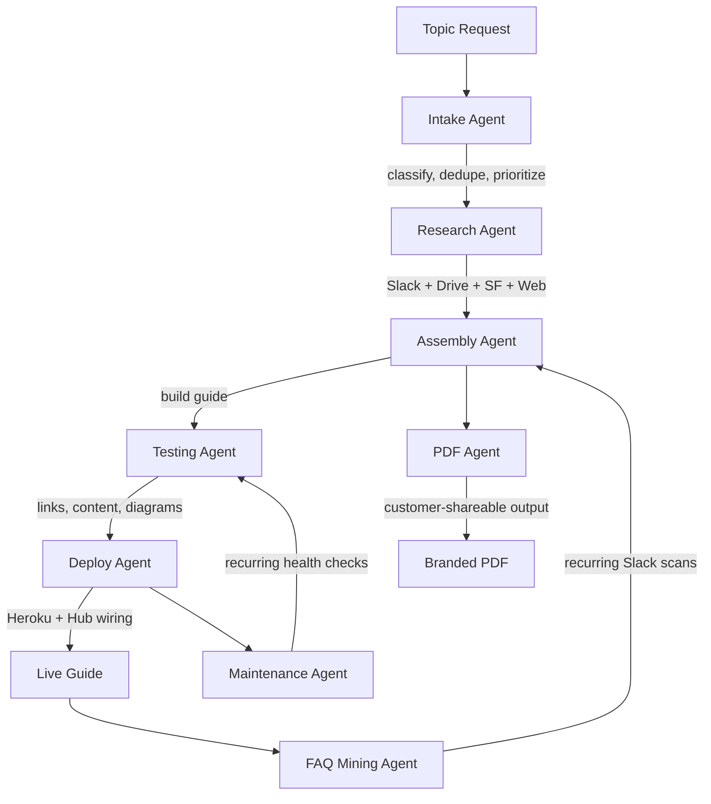

# Enablement Architecture

A meta-guide documenting the architecture, design system, and multi-agent pipeline for building Salesforce field enablement guides.

---


---

## What It Does

This project serves as the canonical reference for the Enablement Hub content system. It documents:

- The **multi-stage content pipeline** that takes a topic request from intake through research, assembly, testing, and deployment.
- The **9 specialized agents** and **7 shared skills** that power the pipeline via Claude Code slash commands.
- The **design system specification** ensuring every field guide ships with a consistent, polished look.
- The **governance model** separating internal-only content from customer-shareable material.
- An interactive **D3-rendered architecture diagram** showing agent relationships and data flows.

Live at: [sf-enablement-architecture-d5e19b04d778.herokuapp.com](https://sf-enablement-architecture-d5e19b04d778.herokuapp.com)

---

## Pipeline



The pipeline is linear from intake to deployment, with two recurring loops (Maintenance and FAQ Mining) that feed back into earlier stages, and a PDF branch that produces customer-facing deliverables on demand.

---

## Design System

All field guides built by the pipeline adhere to these visual standards:

| Element | Specification |
|---------|---------------|
| **Background** | Drifting clouds animation (CSS keyframe, layered gradients) |
| **Top Bar** | Frosted glass effect (`backdrop-filter: blur(12px)`, semi-transparent white) |
| **Heading Font** | Newsreader (serif), variable weight |
| **Body Font** | Salesforce Sans (system fallback: -apple-system, BlinkMacSystemFont) |
| **Primary Color** | `#0176D3` (Salesforce Blue) |
| **Accent Color** | `#032D60` (Deep Navy) |
| **Surface Color** | `rgba(255, 255, 255, 0.85)` (frosted card panels) |
| **Card Components** | Rounded corners (`border-radius: 12px`), subtle box-shadow, hover lift transition |
| **Content Width** | Max `900px`, centered with responsive padding |
| **Audience Toggle** | Internal content hidden by default; toggle reveals internal-only annotations |

---

## Agent Inventory

| # | Agent | Responsibility |
|---|-------|---------------|
| 1 | **Intake Agent** | Accepts topic submissions, classifies by type, deduplicates against existing guides, assigns priority |
| 2 | **Research Agent** | Searches Slack, Google Drive, Salesforce, and the web in parallel; produces structured research report with source rankings |
| 3 | **Assembly Agent** | Builds the standalone HTML/CSS/JS field guide from research output, applying the design system |
| 4 | **Testing Agent** | Validates links, scans for internal URLs, checks content completeness, verifies diagram freshness |
| 5 | **Deploy Agent** | Pushes to Heroku, verifies deployment, updates Hub sidebar/cards/changelog, supports rollback |
| 6 | **Maintenance Agent** | Weekly health checks across all deployed topics: content freshness, link rot, diagram staleness |
| 7 | **FAQ Mining Agent** | Searches Slack channels and canvases for questions, deduplicates against existing FAQs, ranks candidates |
| 8 | **PDF Agent** | Generates branded customer-facing PDFs with unique layouts per topic type; strips internal content |
| 9 | **Video-to-Guide Agent** | Transcribes video content, feeds into research pipeline, builds standalone guide from recordings |

---

## Shared Skills

The agents share 7 reusable skills that provide common capabilities:

1. **Slack Search** -- Query channels, threads, and canvases for relevant content
2. **Google Drive Search** -- Find and read documents, slides, and sheets
3. **Salesforce Query** -- Run SOQL against org62 for product data and metadata
4. **Web Fetch** -- Retrieve external documentation and reference material
5. **Hub Wiring** -- Update the Enablement Hub sidebar, cards, and changelog entries
6. **Content Validation** -- Link checking, internal URL detection, completeness scoring
7. **Design System Application** -- Apply fonts, colors, layout, and components consistently

---

## Deployment

**Tech stack:** Static HTML, CSS, and JavaScript with D3.js for the interactive architecture diagram.

**Buildpack:** Heroku PHP buildpack (serves static files via Apache).

**Files:**

```
EnablementArchitecture/
├── index.html       # Interactive D3 architecture diagram + documentation
├── composer.json    # Heroku PHP buildpack marker
├── Procfile         # Apache web server configuration
└── README.md        # This file
```

**Deploy:**

```bash
git push heroku main
```

**Environment:** No environment variables or secrets required. The app is entirely client-side.

---

## Slash Commands Reference

These Claude Code slash commands map to the pipeline stages:

| Command | Pipeline Stage |
|---------|---------------|
| `/intake` | Accept and classify a new topic |
| `/research` | Run parallel source searches |
| `/article` | End-to-end pipeline (intake through deploy) |
| `/deploy-guide` | Push to Heroku and wire into Hub |
| `/test-guides` | Run validation suite |
| `/maintenance` | Weekly health check |
| `/faq-mine` | Search Slack for FAQ candidates |
| `/pdf-generate` | Produce customer-facing PDF |
| `/video-to-guide` | Video transcription to guide |

---

## Content Governance

The system enforces strict separation between internal and customer-shareable content:

- **Internal content** includes Slack links, internal org62 references, employee names, and deal-specific context.
- **Customer-shareable content** passes through a scrubbing step that removes internal URLs, replaces names with roles, and validates no sensitive data leaks.
- The **audience toggle** in each guide allows internal viewers to see annotations while ensuring the exported version is clean.
- The **Testing Agent** runs a dedicated internal-URL scan before any PDF generation or external sharing.

---

## Verification Workflow

Before any guide goes live:

1. Testing Agent validates all links return 200
2. Content completeness score must exceed threshold
3. No internal URLs detected in customer-facing sections
4. Diagrams regenerated if source data changed
5. Human review checkpoint for new topics (bypassed for FAQ updates)
